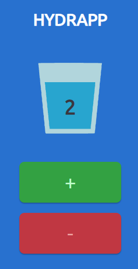

# HYDRAPP
PWA project, where I used:
- HTML
- CSS/SCSS
- JS
- NPM
- Webpack
## Run with:
`npm install` and `npm run start` (localhost:8080)
### You can find presentation [here](https://pawel-jezior.github.io/hydrapp/) on any device!

### Project base generated from wtf-webpack template.

